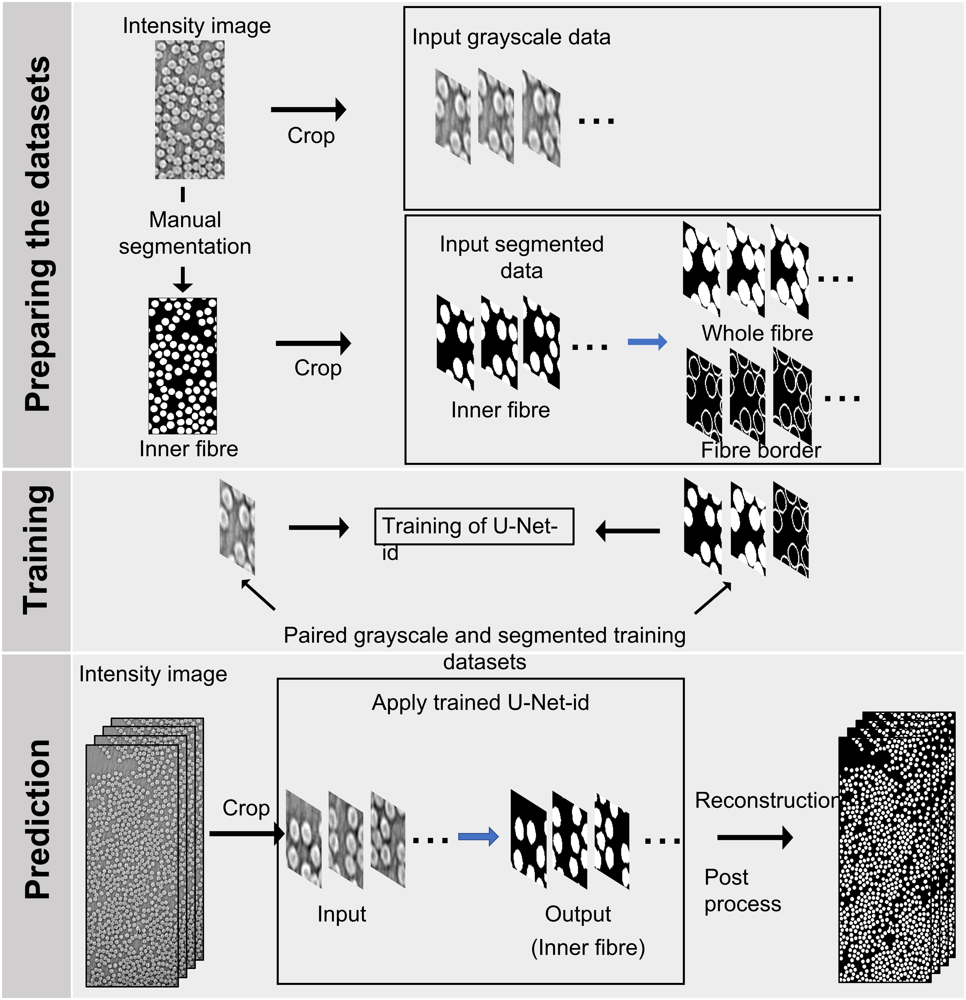

<!-- PROJECT LOGO -->
<br />
<div align="center">
  </a>

  <h3 align="center">FibreSegt_PyTorch</h3>

  <p align="center">
    Individual fibre segmentation with PyTorch based on
    <br />
    <a href="https://www.mdpi.com/2072-4292/12/10/1544/htm"><strong>U-Net-ID
    </strong></a>
    
  </p>
</div>

<!--  -->

<!-- TABLE OF CONTENTS -->
<details>
  <summary>Table of Contents</summary>
  <ol>
    <li>
      <a href="#introduction">Introduction</a>
    </li>
    <li>
      <a href="#getting-started">Getting Started</a>
      <ul>
        <li><a href="#prerequisites">Prerequisites</a></li>
      </ul>
    </li>
    <li>
      <a href="#usage">Usage</a>
        <ul>
        <li><a href="#training">Training</a></li>
        <li><a href="#segment-slices">Segment slices</a></li>
        <li><a href="#segment-volume">Segment volume</a></li>
        <li><a href="#evaluation">Evaluation</a></li>
      </ul>
    </li>
    <li><a href="#pretrained-model">Pretrained model</a></li>
    <li><a href="#how-fibresegt-works">How FibreSegt works</a></li>
    <li><a href="#citation">Citation</a></li>
    <li><a href="#contributors">Contributors</a></li>
  </ol>
</details>

## Introduction
This project, **FibreSegt**, is designed for the automatic segmentation of individual fibres in unidirectional fibre reinforced composites. It is a powerful tool that allows for the understanding of the characteristics of composite microstructures. FibreSegt can be used for:

    Segmentation of low contrast and relatively low resolution CT images
    Automated segmentation of large 3D CT data

With FibreSegt, you can easily segment and analyze composite microstructures, providing you with valuable insights that can help improve the performance and strength of your materials.
  
## Getting Started
This project has been tested on Pytorch 1.9.0, Python 3.9.5, and Windows 10 using an NVIDIA RTX A5000 GPU.
### Prerequisites
1. Install [CUDA](https://developer.nvidia.com/cuda-downloads)
2. Install [PyTorch](https://pytorch.org/)  
   To ensure compatibility, please check the PyTorch website for the recommended version of PyTorch for your version of CUDA.
If you need to install the previous PyTorch versions, please check [here](https://pytorch.org/get-started/previous-versions/).
3. Install [JupyterNotebook or JupyterLab](https://jupyter.org/install)
4. Install fibresegt:  
- Download the codes 
- pip install .

### Check the installation
- To check if the PyTorch GPU version has been installed successfully, run the following commands in Python:
```bash
import torch
print(torch.cuda.is_available())
print(torch.version.cuda)
```
- To check if the package 'fibresegt' has been installed successfully, run the following commands in Python:
 ```bash
import fibresegt as fs
print(fs.version)
```

## Usage
We have provided several jupyter notebooks to aid in understanding the usage of FibreSegt for individual fibre segmentation.

### Training
Train a model from scratch using 2D slices.
```bash
notebooks/trainfibre2D.ipynb
```

### Segment slices
Perform segmentation on any specified 2D slice.
```bash
notebooks/segmfibre2D.ipynb
```

### Segment volume
Perform segmentation on a 3D CT volume.
```bash
notebooks/segmfibre3D.ipynb
```

### Evaluation
Evaluate the segmentation results on an entire 3D dataset.
```bash
notebooks/evalulate.ipynb
```


## Pretrained model
A pre-trained model is available for the slow-acquisition dataset and can be found [here](/output/demo/checkpoint/).

## How FibreSegt works
  1. The first step is to create a mask for the training image and crop them to the specified image size.
  2. The second step is to train the U-Net-id model using paired grayscale and manually labelled images.
  3. The final step is to use the trained U-Net-id model to segment other datasets.  
This is the flowchart: 


## Citation
If you use the codes, please cite our paper:


## Contributors
