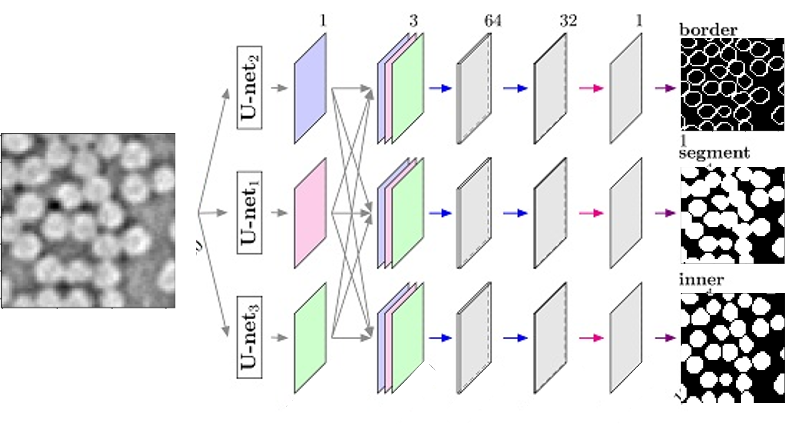
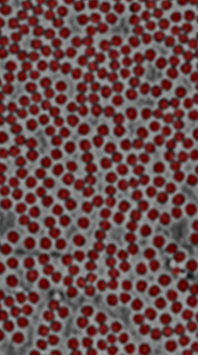
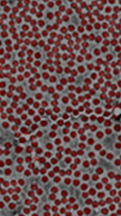

<!-- PROJECT LOGO -->
<br />
<div align="center">
  </a>

  <h3 align="center">UnetBasedSegm_PyTorch</h3>

  <p align="center">
    Individual fibre segmentation with PyTorch based on
    <br />
    <a href="https://www.mdpi.com/2072-4292/12/10/1544/htm"><strong>U-Net-ID
    </strong></a>
    
  </p>
</div>



<!-- TABLE OF CONTENTS -->
<details>
  <summary>Table of Contents</summary>
  <ol>
    <li>
      <a href="#introduction">Introduction</a>
    </li>
    <li>
      <a href="#getting-started">Getting Started</a>
      <ul>
        <li><a href="#prerequisites">Prerequisites</a></li>
      </ul>
    </li>
    <li>
      <a href="#usage">Usage</a>
        <ul>
        <li><a href="#training">Training</a></li>
        <li><a href="#Segment-2D-fibre">Segment 2D fibre</a></li>
        <li><a href="#Segment-3D&4D-fiber&4D">Segment 3D&4D fiber</a></li>
      </ul>
    </li>
    <li><a href="#pretrained-model">Pretrained model</a></li>
  </ol>
</details>

## Introduction
This project is used to automatically segment individual fibres for unidirectional fibre reinforced composites, which is the first step to help understand the characteristics of the composite microstructures.  
This tool can be used for 
* Low contrast and low resolutions CT images
* Segmentation of 3D and 4D CT data
  
## Getting Started
This project is tested on the Pytorch1.9.0, Python3.9.5 on Windows.   
The GPU is NVIDIA RTX A5000 
### Prerequisites
1. Install [CUDA](https://developer.nvidia.com/cuda-downloads)
2. Install [PyTorch](https://pytorch.org/)  
   Install [Previous PyTorch version](https://pytorch.org/get-started/previous-versions/)  
   Notice the PyTorch version and CUDA version need to be compatible.
3. Install dependencies:
```bash
pip install -r requirements.txt
```
[Anaconda](https://www.anaconda.com/products/distribution#download-section) or [Miniconda](https://docs.conda.io/en/latest/miniconda.html#linux-installers) is recommended, then you can create the unetbasedsegm_torch1.9 environment with commands below:
```bash
conda create -n unetbasedsegm_torch1.9 python=3.9.5
conda activate unetbasedsegm_torch1.9
conda install pytorch==1.9.0 torchvision==0.10.0 torchaudio==0.9.0 cudatoolkit=11.1 -c pytorch -c conda-forge
or pip install torch==1.9.0+cu111 torchvision==0.10.0+cu111 torchaudio==0.9.0 -f https://download.pytorch.org/whl/torch_stable.html
conda install ipykernel
python -m ipykernel install --user --name unetbasedsegm_torch1.9 --display-name "unetbasedsegm_torch1.9"
pip install -r requirements.txt
```
### Check the installation
Check the PyTorch GPU version is installed successfully
```bash
python
import torch
print(torch.cuda.is_available())
print(torch.version.cuda)
```

## Usage
### Training
Train from scratch based on the 2D slice.
```bash
trainfibre2D.ipynb
```
### Segment 2D fibre
Segmentation of any specified 2D slice.
```bash
segmfibre2D.ipynb
```

### Segment 3D&4D fiber
Segmentation of 3D&4D data based on the 2D slice.
```bash
segmfiber3D&4D.ipynb
```



## Pretrained model
A [pretrained model](output/T700-T-17/model/visionary-disco-21/) is available for the T700 unidirectional composite.